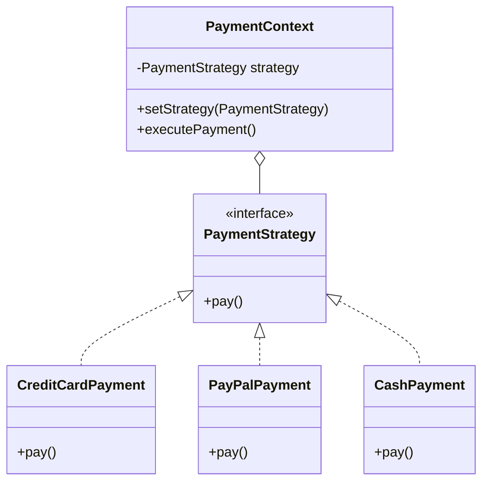
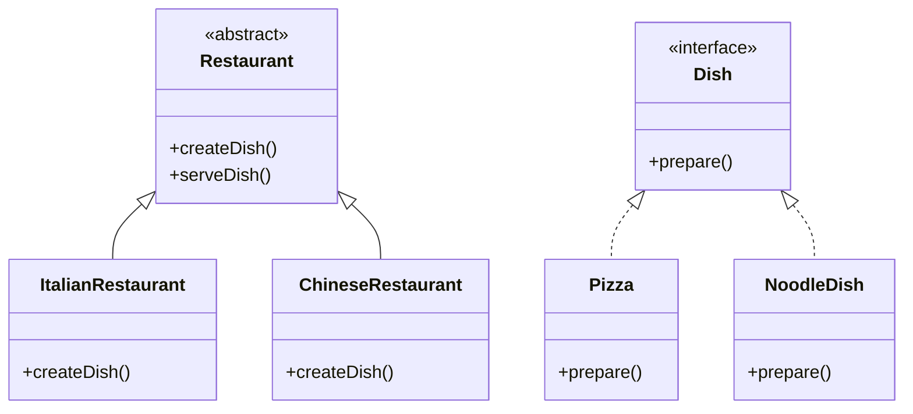
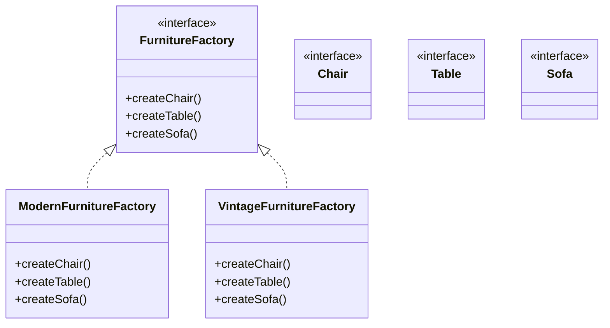
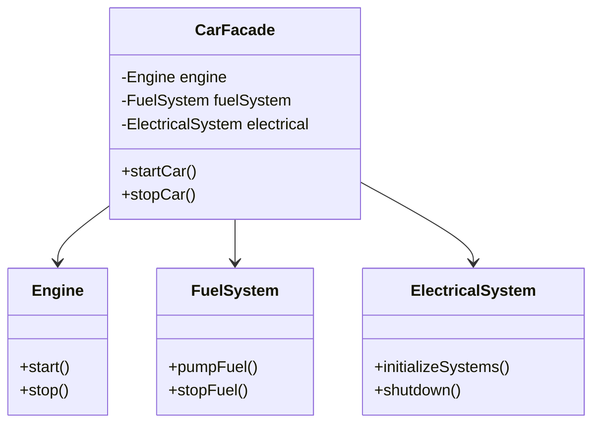
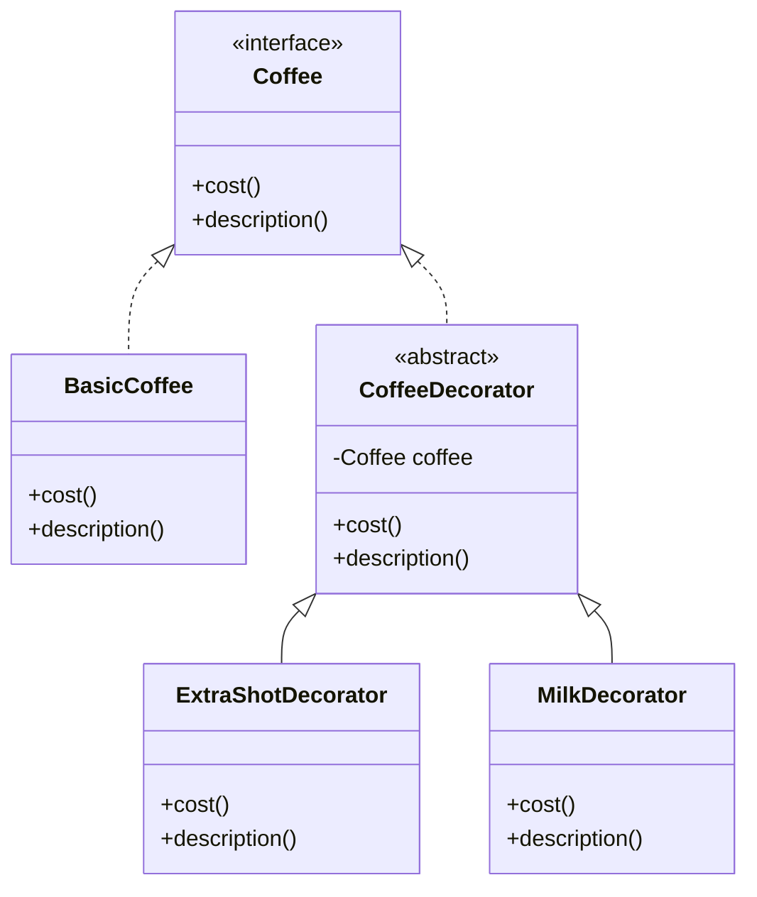
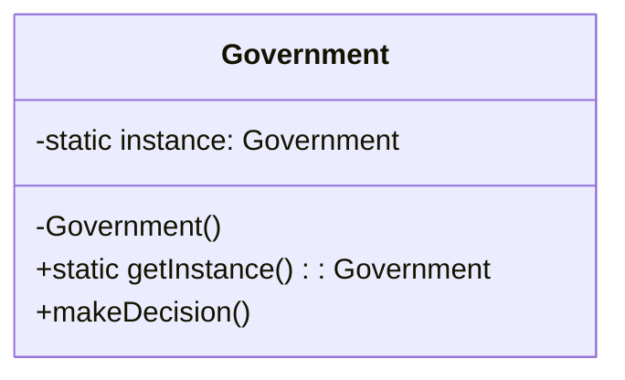
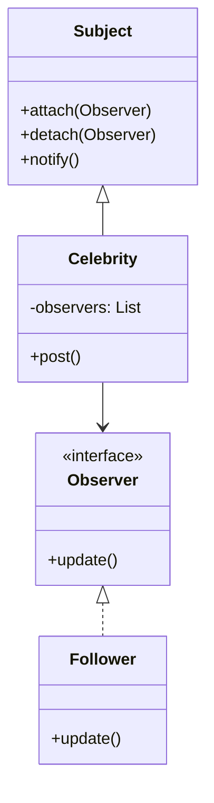
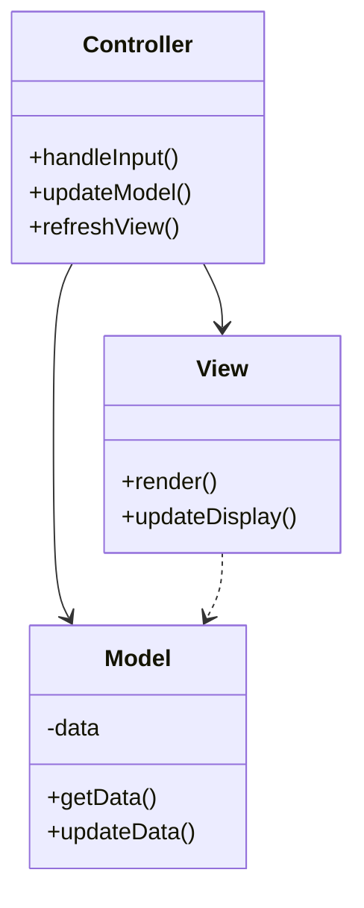

# Design Patterns Explained

This paper provides clear explanations of common design patterns, complete with UML diagrams and real-world analogies.

## 1. Strategy Pattern
**Definition:** Defines a family of algorithms, encapsulates each one, and makes them interchangeable.

**Real-World Analogy:** Think of different payment methods at a store. Whether you pay by credit card, PayPal, or cash, the end result (payment) is the same, but the strategy (how you pay) differs.

**UML Diagram:**

## 2. Factory Method Pattern
**Definition:** Provides an interface for creating objects but allows subclasses to decide which class to instantiate.

**Real-World Analogy:** A restaurant kitchen receiving orders. The kitchen (factory) knows how to create different dishes (products), but the specific chef (concrete factory) decides how to prepare each dish.

**UML Diagram:**

## 3. Abstract Factory Pattern
**Definition:** Provides an interface for creating families of related or dependent objects without specifying their concrete classes.

**Real-World Analogy:** A furniture manufacturer that creates different styles of furniture (modern, vintage, etc.). Each style includes matching chairs, tables, and sofas.

**UML Diagram:**

## 4. Façade Pattern
**Definition:** Provides a unified interface to a set of interfaces in a subsystem, making it easier to use.

**Real-World Analogy:** A car's dashboard. You don't need to understand the complex systems (engine, fuel injection, electrical) to drive - the dashboard provides a simple interface.

**UML Diagram:**

## 5. Decorator Pattern
**Definition:** Attaches additional responsibilities to an object dynamically, providing a flexible alternative to subclassing.

**Real-World Analogy:** Customizing a coffee order. You start with a basic coffee and can "decorate" it with extra shots, milk, sugar, etc.

**UML Diagram:**

## 6. Singleton Pattern
**Definition:** Ensures a class has only one instance and provides a global point of access to it.

**Real-World Analogy:** A country's government. There can only be one active government at a time, and everyone refers to that same government.

**UML Diagram:**

## 7. Observer Pattern
**Definition:** Defines a one-to-many dependency between objects so that when one object changes state, all its dependents are notified and updated automatically.

**Real-World Analogy:** Social media followers. When a celebrity posts something (subject), all followers (observers) get notified.

**UML Diagram:**

## 8. Model-View-Controller (MVC)
**Definition:** Separates an application into three interconnected components: Model (data), View (user interface), and Controller (business logic).

**Real-World Analogy:** A restaurant where the kitchen (Model) prepares food, the dining room (View) presents it to customers, and the waiter (Controller) coordinates between them.

**UML Diagram:**

---

## Summary
These design patterns represent proven solutions to common software design problems. Each pattern serves a specific purpose:
- **Strategy**: Flexible algorithm selection
- **Factory Method**: Object creation delegation
- **Abstract Factory**: Related object family creation
- **Façade**: Simplified interface to complex system
- **Decorator**: Dynamic feature addition
- **Singleton**: Single instance guarantee
- **Observer**: Event notification system
- **MVC**: Separation of concerns

Understanding these patterns helps in creating more maintainable, flexible, and robust software systems. 